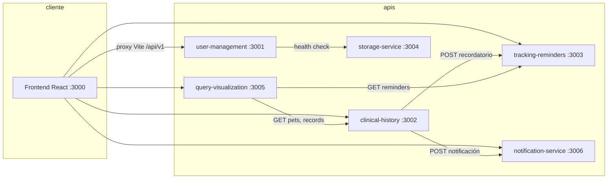

# Guía de exposición — VetCare System

Documento de estudio para la **exposición y demo** (22/05/2026). Sigue la misma estructura del entregable PDF (*VetCare_Proyecto_Final_Completo.pdf*) y explica **qué tenemos**, **cómo lo usamos** y **dónde está en el repositorio**.

---

## Índice (espejo del PDF)

1. [Descripción del problema](#1-descripción-del-problema)
2. [Abstract y decisión arquitectónica](#2-abstract-y-decisión-arquitectónica)
3. [Atributos de calidad → dónde se materializan](#3-atributos-de-calidad--dónde-se-materializan)
4. [ADR-001 — Microservicios](#4-adr-001--microservicios)
5. [ADR-002 — Monorepo](#5-adr-002--monorepo)
6. [ADR-003 — REST + OpenAPI](#6-adr-003--rest--openapi)
7. [Repositorio y tecnologías](#7-repositorio-y-tecnologías)
8. [Capas del diagrama → código](#8-capas-del-diagrama--código)
9. [Solución implementada (demo)](#9-solución-implementada-demo)
10. [Preguntas probables en la exposición](#10-preguntas-probables-en-la-exposición)

---

## 1. Descripción del problema

**Qué decir:** En Colombia ~63% de hogares tienen mascotas; muchas clínicas usan registros aislados; faltan vacunas y controles; los diagnósticos llegan tarde. VetCare centraliza historial clínico, recordatorios y acceso por roles.

**Dónde está en el repo:** No es código; está en el PDF y resumido en [README.md](../README.md) y [docs/adr-001-arquitectura.md](adr-001-arquitectura.md).

---

## 2. Abstract y decisión arquitectónica

| Concepto del PDF | Qué tenemos | Dónde |
|------------------|-------------|--------|
| 6 microservicios independientes | Sí, 6 carpetas bajo `services/` | `services/user-management`, `clinical-history`, `tracking-reminders`, `storage-service`, `query-visualization`, `notification-service` |
| REST + OpenAPI 3.0 | Contratos en `shared/contracts/`; APIs en Express | Ver [§6](#6-adr-003--rest--openapi) |
| Monorepo | Un solo repo GitHub | Raíz del proyecto |
| 4 atributos de calidad | Diseñados en PDF; **parcialmente** demostrables en demo | Ver [§3](#3-atributos-de-calidad--dónde-se-materializan) |
| Alternativas descartadas | Documentadas | `docs/adr-001-arquitectura.md` |

---

## 3. Atributos de calidad — dónde se materializan

El PDF define **8 escenarios** en 4 atributos. En la demo actual puedes **explicar el diseño** y **mostrar lo que ya está en código**.

### 3.1 Seguridad (RBAC + JWT)

| Escenario PDF | Artefacto | Implementación real | Ubicación |
|---------------|-----------|---------------------|-----------|
| Acceso sin permisos al historial | `user-management` | Login JWT; rutas protegidas con `authMiddleware` | `services/user-management/src/index.js` |
| Edición clínica sin rol | `clinical-history` | `canEditClinical()` solo `VETERINARIO` / `ADMIN`; dueño solo lectura y notas | `services/clinical-history/src/index.js` |
| UI por rol | Frontend | `RoleRoute`, `ProtectedRoute` | `frontend/src/components/RoleRoute.tsx`, `App.tsx` |

**Cómo demostrarlo en vivo:**

1. Login como dueño: `dueno@vetcare.co` / `dueno123` → no puede crear mascotas ni registros clínicos (rutas bloqueadas en UI y API 403).
2. Login como veterinario: `demo@vetcare.co` / `demo123` → puede CRUD de mascotas e historial.
3. Sin token → `401` en cualquier endpoint protegido.

**Roles y usuarios demo** (semilla al arrancar `user-management`):

| Email | Contraseña | Rol |
|-------|------------|-----|
| `demo@vetcare.co` | `demo123` | VETERINARIO |
| `admin@vetcare.co` | `admin123` | ADMIN |
| `dueno@vetcare.co` | `dueno123` | DUENO |

JWT: se genera en `POST /api/v1/auth/login`; el frontend guarda token en `localStorage` (`vetcare_token`) — `frontend/src/context/AuthContext.tsx`.

### 3.2 Fiabilidad

| Escenario PDF | Estado en repo | Nota honesta para la exposición |
|---------------|----------------|----------------------------------|
| **Esc.3** Failover storage &lt; 5 s | **Stub** | `storage-service` — comentarios `Escenario 3`; `/health` + detección en admin (`checkServiceHealth`). Sin nodo backup automático aún. |
| **Esc.4** Registro clínico sin error | **Sí (demo)** | `clinical-history` — `validateRecordBody`, `POST .../records`, `ClinicalRecordFormPage` (confirmación). Memoria en `Map`; al reiniciar se pierden. |

En código busca **`Escenario 3`** o **`Escenario 4`** (mismo estilo que Seguridad esc. 1 y 2).

Persistencia actual: **memoria en proceso** (no PostgreSQL del PDF). Mencionar que el diseño apunta a *database per service* en fase 3.

### 3.3 Eficiencia de desempeño

| Escenario PDF | Estado en repo |
|---------------|----------------|
| Consulta historial &lt; 2 s | Agregación en `query-visualization` que llama a `clinical-history` y `tracking-reminders` |
| 1000 usuarios / CPU &lt; 80% | **Diseño** (Kubernetes); no hay métricas Prometheus en el repo aún |

Dashboard agregado: `GET /api/v1/dashboard` → `services/query-visualization/src/index.js` (orquesta llamadas REST a puertos 3002 y 3003).

### 3.4 Escalabilidad

| Escenario PDF | Estado en repo |
|---------------|----------------|
| Nuevo microservicio en `/services/` | Estructura lista; añadir carpeta + contrato OpenAPI + entrada en `docker-compose` |
| Escalado horizontal K8s | `infrastructure/docker-compose.yml` existe; **manifiestos K8s pendientes** (fase 3 en README) |

---

## 4. ADR-001 — Microservicios

Cada microservicio del PDF tiene carpeta, puerto, contrato y responsabilidad.

### Tabla maestra (PDF ↔ repo ↔ puerto ↔ frontend)

| Microservicio | Responsabilidad (PDF) | Carpeta | Puerto | Contrato OpenAPI | ¿Lo usa el frontend? |
|---------------|----------------------|---------|--------|------------------|----------------------|
| **user-management** | Auth JWT, usuarios, RBAC, admin | `services/user-management/` | **3001** | `shared/contracts/user-management/openapi.yaml` | **Sí** — login, registro, perfil, admin |
| **clinical-history** | Mascotas + historial clínico | `services/clinical-history/` | **3002** | `shared/contracts/clinical-history/openapi.yaml` | **Sí** — mascotas e historial |
| **tracking-reminders** | Alertas vacunas/controles | `services/tracking-reminders/` | **3003** | `shared/contracts/tracking-reminders/openapi.yaml` | **Sí** — `/recordatorios` |
| **storage-service** | Persistencia central / respaldo | `services/storage-service/` | **3004** | `shared/contracts/storage-service/openapi.yaml` | **No** (solo health en admin) |
| **query-visualization** | Dashboard agregado | `services/query-visualization/` | **3005** | `shared/contracts/query-visualization/openapi.yaml` | **Sí** — `/inicio` |
| **notification-service** | Alertas in-app / envío | `services/notification-service/` | **3006** | `shared/contracts/notification-service/openapi.yaml` | **Sí** — campana de notificaciones |

### Comunicación **entre** microservicios (no pasa por el navegador)



- **clinical-history → tracking-reminders:** al crear consulta con fecha de seguimiento, `postReminder()` en `clinical-history/src/index.js`.
- **clinical-history → notification-service:** `notifyOwner()` tras eventos clínicos.
- **query-visualization → clinical-history + tracking-reminders:** agrega datos para el dashboard.
- **user-management → todos:** panel admin consulta `/health` de cada servicio (lista en `user-management/src/index.js`).

**storage-service:** en la demo es **preparación arquitectónica** (endpoints stub). El PDF lo asocia a fiabilidad; en código aún no persiste archivos ni backups.

---

## 5. ADR-002 — Monorepo

Estructura real (alineada al PDF y ADR-002):

```
VetCareSystem_Code/
├── services/              # 6 microservicios (Node.js + Express)
├── shared/contracts/      # OpenAPI 3.0 por servicio
├── infrastructure/        # docker-compose.yml
├── docs/                  # ADRs + esta guía
├── frontend/              # React + TypeScript + Vite
├── scripts/dev.ps1        # Atajo Windows: install + npm run dev
├── package.json           # Orquesta los 7 procesos (6 APIs + web)
└── README.md
```

| Elemento ADR-002 | Ubicación | Uso |
|------------------|-----------|-----|
| README por servicio | `services/*/README.md` | Cómo levantar cada API |
| ADRs | `docs/adr-001-*.md`, `adr-002-*.md`, `adr-003-*.md` | Defensa oral y trazabilidad |
| IaC local | `infrastructure/docker-compose.yml` | `docker compose up` sin frontend |
| Contratos compartidos | `shared/contracts/<servicio>/openapi.yaml` | Contract-first; enlaces en `/api-docs` |
| `.gitignore` raíz | `.gitignore` | node_modules, .env |

**Cómo ejecutar todo (recomendado para demo):**

```bash
# Raíz del repo
npm run install:auth
npm run dev
# o en Windows:
.\scripts\dev.ps1
```

Abrir: **http://localhost:3000**

---

## 6. ADR-003 — REST + OpenAPI

### Rutas base del PDF vs implementación

| Servicio | Ruta base (PDF) | Prefijo real | Implementación |
|----------|-----------------|--------------|----------------|
| user-management | `POST /api/v1/auth`, `GET /api/v1/users/{id}` | `/api/v1` | `auth/login`, `auth/register`, `auth/me`, `users/:id`, `admin/*` |
| clinical-history | `GET/POST .../patients/{id}/records` | `/api/v1` | También `pets` (mascotas); registros en `patients/:petId/records` |
| tracking-reminders | `GET/POST /api/v1/reminders` | `/api/v1/reminders` | CRUD + `complete`, `confirm` |
| storage-service | `GET/PUT /api/v1/storage/{resource}` | Stub | Respuesta de contrato pendiente |
| query-visualization | `GET /api/v1/dashboard/{petId}` | `/api/v1/dashboard`, `/dashboard/:petId` | Agregación cross-service |
| notification-service | `POST /api/v1/notifications/send` | `/notifications`, `/notifications/send` | In-app + demo |

### Proxy del frontend (sustituto local del API Gateway)

En producción el PDF propone **Kong / AWS API Gateway**. En desarrollo, **Vite** enruta por path:

| Prefijo HTTP | Microservicio | Archivo |
|--------------|---------------|---------|
| `/api/v1/pets`, `/api/v1/patients` | clinical-history :3002 | `frontend/vite.config.ts` |
| `/api/v1/reminders` | tracking-reminders :3003 | idem |
| `/api/v1/dashboard` | query-visualization :3005 | idem |
| `/api/v1/notifications` | notification-service :3006 | idem |
| `/api` (resto) | user-management :3001 | idem |

Cliente HTTP único: `frontend/src/services/apiClient.ts` → todas las llamadas van a `/api/v1...` con header `Authorization: Bearer`.

### Servicios frontend → API

| Archivo `frontend/src/services/` | Microservicio | Pantallas principales |
|----------------------------------|---------------|------------------------|
| `authApi.ts` | user-management | Login, registro, perfil |
| `petsApi.ts` | clinical-history (+ `users/owners` en UM) | Lista/detalle/form mascotas |
| `clinicalApi.ts` | clinical-history | Historial clínico |
| `remindersApi.ts` | tracking-reminders | `/recordatorios` |
| `dashboardApi.ts` | query-visualization | `/inicio` |
| `notificationsApi.ts` | notification-service | Campana / toasts |
| `adminApi.ts` | user-management + notification-service | `/admin` |

---

## 8. Capas del diagrama — código

### Capa de usuarios (actores)

| Actor PDF | Rol en sistema | Panel / rutas |
|-----------|----------------|---------------|
| Veterinario | `VETERINARIO` | `/panel/veterinario`, mascotas, historial |
| Dueño | `DUENO` | `/panel/dueno`, historial lectura, notas opcionales |
| Administrador | `ADMIN` | `/admin`, gestión usuarios, observabilidad simulada |

Definición de rutas por rol: `frontend/src/App.tsx` (`RoleRoute`).

### Capa de presentación

| PDF | Repo |
|-----|------|
| Frontend web React | `frontend/` — React 18 + **TypeScript** + Vite |
| App móvil | **No implementada** (solo mencionada en arquitectura) |

Páginas clave:

| Ruta | Página | Función |
|------|--------|---------|
| `/login` | `LoginPage.tsx` | Autenticación |
| `/registro` | `RegisterPage.tsx` | Alta dueño/veterinario |
| `/inicio` | `DashboardPage.tsx` | KPIs vía query-visualization |
| `/mascotas` | `PetsListPage.tsx` | Listado mascotas |
| `/mascotas/:id/historial` | `ClinicalHistoryPage.tsx` | Timeline clínico |
| `/recordatorios` | `RemindersPage.tsx` | Recordatorios |
| `/admin` | `AdminPage.tsx` | Usuarios, logs, health servicios |
| `/api-docs` | `ApiDocsPage.tsx` | Enlaces a contratos OpenAPI |
| `/perfil` | `ProfilePage.tsx` | Perfil y contraseña |

### Capa API Gateway

| PDF | Demo actual |
|-----|-------------|
| Kong / AWS API Gateway | **Proxy Vite** (`vite.config.ts`) + CORS en cada Express |

### Capa microservicios

Ver [§4](#4-adr-001--microservicios).

### Capa persistencia

| PDF | Demo actual |
|-----|-------------|
| PostgreSQL + Redis | **Memoria (`Map`)** en cada servicio; reinicio = datos demo se re-sembran |
| Database per service | Separación lógica por servicio, no por motor de BD aún |

### Infraestructura y observabilidad

| PDF | Repo |
|-----|------|
| Docker por servicio | `services/*/Dockerfile` + `infrastructure/docker-compose.yml` |
| Kubernetes | Pendiente (README fase 3) |
| Prometheus / Grafana / Jaeger | Panel admin muestra **logs simulados** (`user-management`); no hay stack real aún |
| GitHub Actions + Spectral | Pendiente (fase 3) |

---

## 9. Solución implementada (demo)

### 9.1 Funcionalidades del PDF — estado

| Funcionalidad PDF | ¿Implementada? | Dónde probarla |
|-------------------|----------------|----------------|
| Registro / login JWT / RBAC | Sí | `/login`, `services/user-management` |
| Historial clínico CRUD | Sí | `/mascotas/:id/historial` |
| Recordatorios preventivos | Sí | `/recordatorios`; auto-alta desde consulta |
| Dashboard visualización | Sí | `/inicio` |
| Notificaciones (email/push) | Parcial | In-app y `POST .../send`; canales email/push **simulados** |
| Swagger UI automático | Parcial | Enlaces a YAML en GitHub (`/api-docs`), no Swagger embebido |
| Documentación ADRs | Sí | `docs/adr-*.md` |

### 9.2 Flujo demo sugerido (5–8 min)

1. **Arquitectura (1 min):** monorepo, 6 servicios, REST, OpenAPI en `shared/contracts`.
2. **Login veterinario** → dashboard con estadísticas agregadas.
3. **Mascota Luna** (semilla) → historial → nueva consulta → ver recordatorio/notificación generados.
4. **Logout → login dueño** → mismo historial en lectura; intentar editar (403 / UI deshabilitada).
5. **Login admin** → usuarios, health de microservicios, broadcast notificación.
6. **`/api-docs`** → contratos OpenAPI como fuente de verdad.

### 9.3 Tecnologías PDF vs repositorio

| Tecnología (PDF) | En el repo hoy |
|------------------|----------------|
| React + JS | React + **TypeScript** |
| Node.js + Express | Sí, los 6 servicios |
| REST + JSON + JWT | Sí |
| OpenAPI 3.0 | Sí en `shared/contracts/` |
| PostgreSQL / Redis | **No** (fase posterior) |
| Docker | Sí (Compose) |
| Kubernetes, CI/CD Spectral, observabilidad real | **Planeado** (README fase 3) |

---

## 10. Preguntas probables en la exposición

Respuestas cortas alineadas al PDF y al código.

### «¿Por qué microservicios y no monolito?»

Por escalado independiente, aislamiento de fallos y despliegue por servicio. Alternativas descartadas en `docs/adr-001-arquitectura.md`. El repo lo demuestra con 6 procesos y 6 puertos.

### «¿Dónde está el contrato OpenAPI?»

`shared/contracts/<nombre-servicio>/openapi.yaml`. Contract-first (ADR-003). La implementación debe alinearse al YAML, no al revés.

### «¿Cómo se comunican los servicios?»

REST síncrono HTTP/JSON. Ejemplo: `query-visualization` llama a `clinical-history` y `tracking-reminders`; `clinical-history` llama a recordatorios y notificaciones. Timeouts y Saga del PDF son **diseño**; en demo las llamadas son `fetch` directo entre localhost.

### «¿Dónde está la seguridad / RBAC?»

- **Emisión y validación JWT:** `user-management` + mismo `JWT_SECRET` en cada servicio.
- **Autorización por rol:** middleware `requireRoles` / `canEditClinical` en backends; `RoleRoute` en frontend.
- Escenario PDF «acceso denegado &lt; 2 s»: respuestas inmediatas `401`/`403` JSON.

### «¿Qué hace storage-service si el front no lo usa?»

Cumple el slot arquitectónico del PDF (persistencia central / failover). Hoy: health + stub de `GET/PUT /storage/:resource`. Admin muestra su estado en health check. Explicar que en producción centralizaría blobs o backups.

### «¿Dónde está PostgreSQL?»

En el **diseño** del documento final; en la **implementación académica actual** los datos viven en memoria para simplificar la demo. Los IDs fijos (ej. mascota Luna) se re-sembran al iniciar `clinical-history`.

### «¿API Gateway?»

Diseño: Kong/AWS (ADR-003). Desarrollo: proxy Vite que unifica `/api/v1` hacia el puerto correcto.

### «¿Cómo agregarían telemedicina (escenario escalabilidad)?»

Nueva carpeta `services/telemedicine/`, contrato en `shared/contracts/telemedicine/`, registro en `docker-compose.yml` y regla en `vite.config.ts` — sin tocar los otros servicios (ADR-001 escenario 7).

### «Atributos de calidad: ¿cómo los cumplen?»

- **Seguridad:** JWT + RBAC demostrable en vivo.
- **Fiabilidad:** aislamiento por proceso (caída de `notification-service` no tumba login); storage failover es roadmap.
- **Desempeño:** dashboard agregado; sin prueba de carga 1000 usuarios en repo.
- **Escalabilidad:** estructura monorepo + Docker; K8s documentado, no desplegado.

### «¿Cómo lo ejecutamos?»

```bash
npm run install:auth && npm run dev
```

| Servicio | URL health |
|----------|------------|
| user-management | http://localhost:3001/health |
| clinical-history | http://localhost:3002/health |
| tracking-reminders | http://localhost:3003/health |
| storage-service | http://localhost:3004/health |
| query-visualization | http://localhost:3005/health |
| notification-service | http://localhost:3006/health |
| frontend | http://localhost:3000 |

---

## Referencias rápidas en el repo

| Tema | Archivo |
|------|---------|
| ADR microservicios | [docs/adr-001-arquitectura.md](adr-001-arquitectura.md) |
| ADR monorepo | [docs/adr-002-estructura-repo.md](adr-002-estructura-repo.md) |
| ADR REST/OpenAPI | [docs/adr-003-comunicacion.md](adr-003-comunicacion.md) |
| Rutas frontend | [frontend/src/App.tsx](../frontend/src/App.tsx) |
| Proxy APIs | [frontend/vite.config.ts](../frontend/vite.config.ts) |
| Orquestación dev | [package.json](../package.json), [scripts/dev.ps1](../scripts/dev.ps1) |
| Docker | [infrastructure/docker-compose.yml](../infrastructure/docker-compose.yml) |

---

*Documento generado para estudio y exposición — VetCare System, Arquitectura de Software 2026.*
